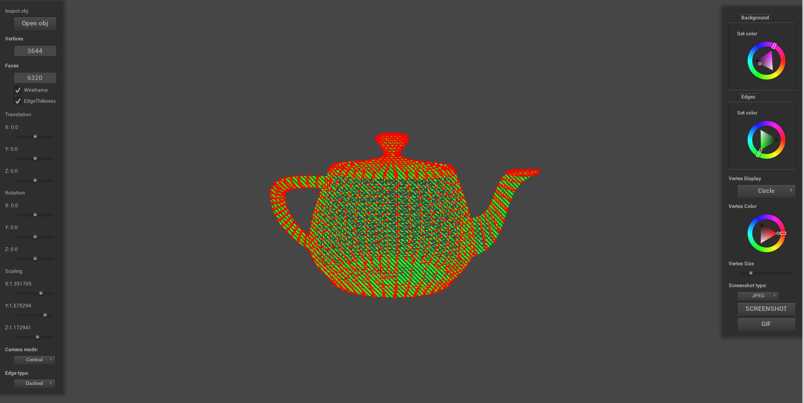
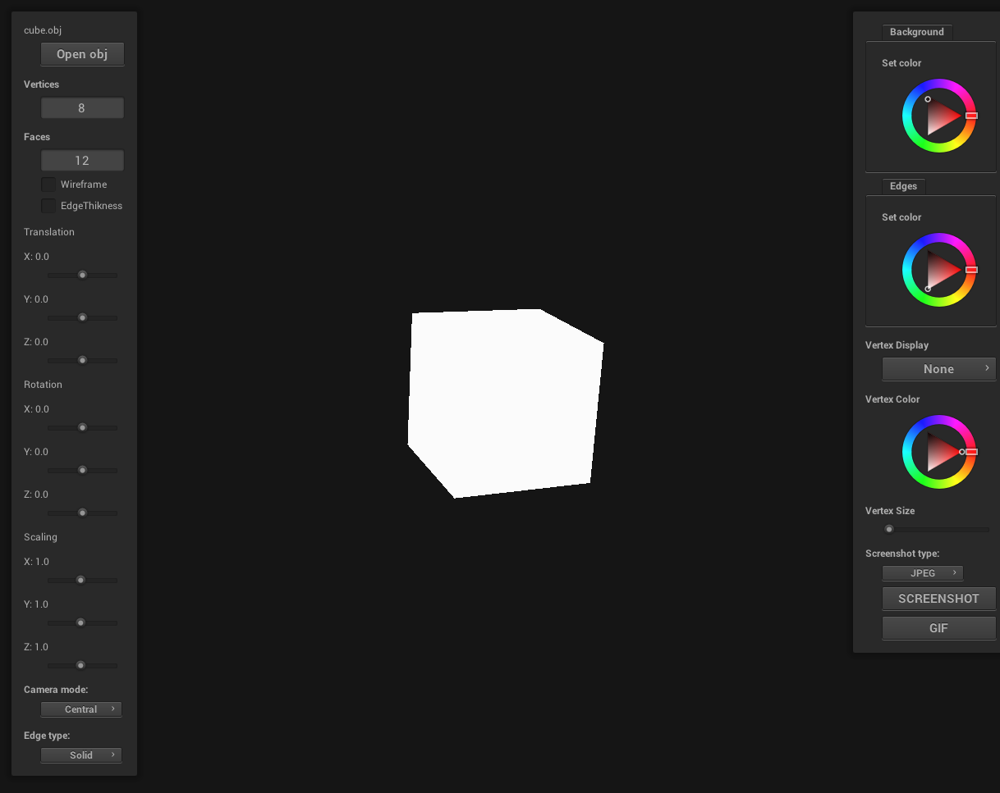
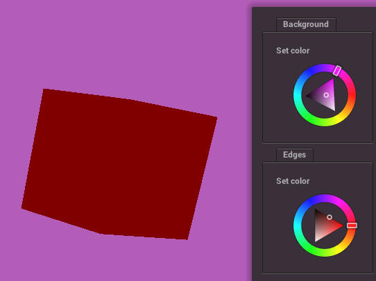
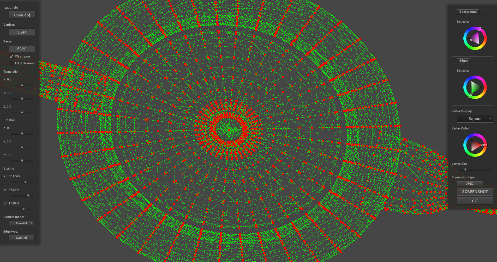
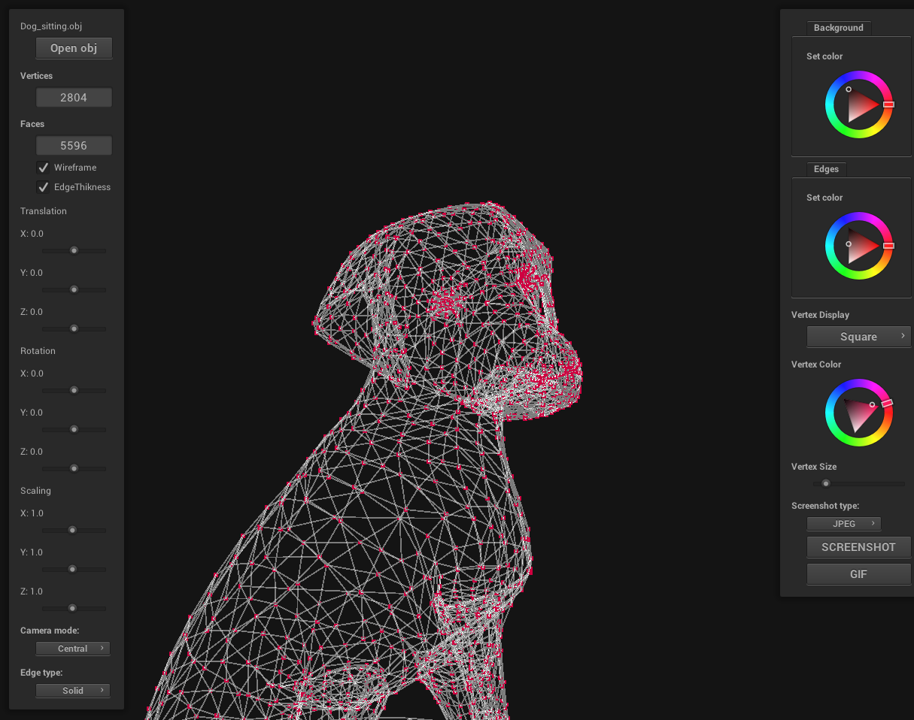
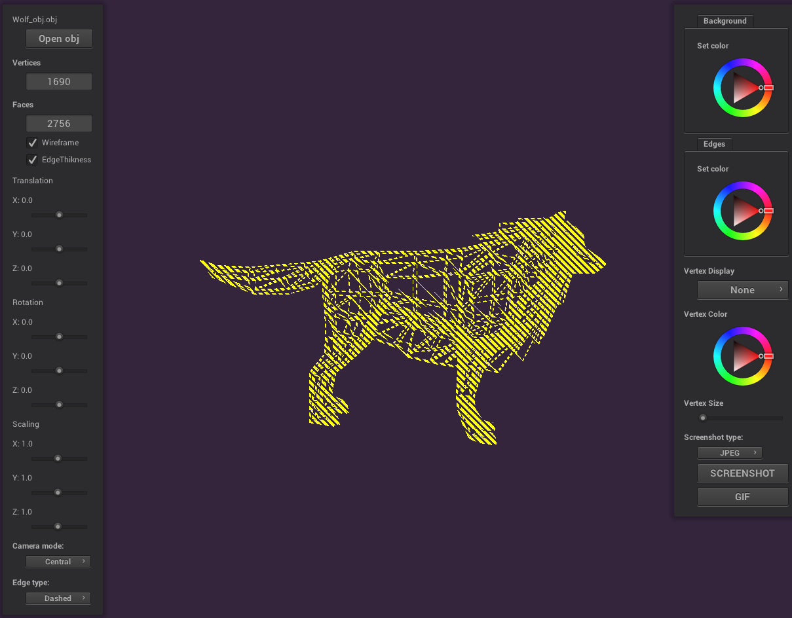
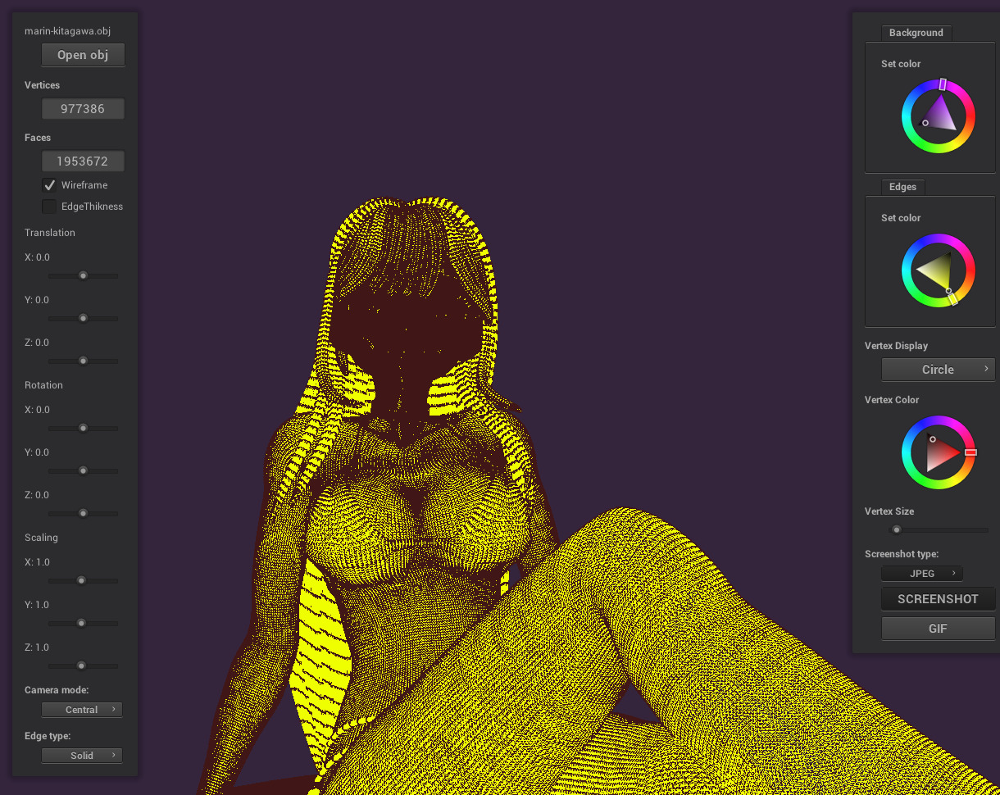
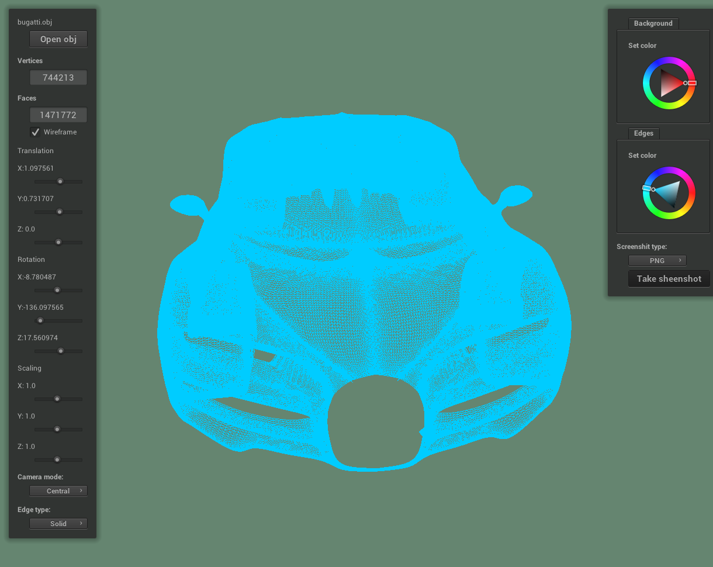
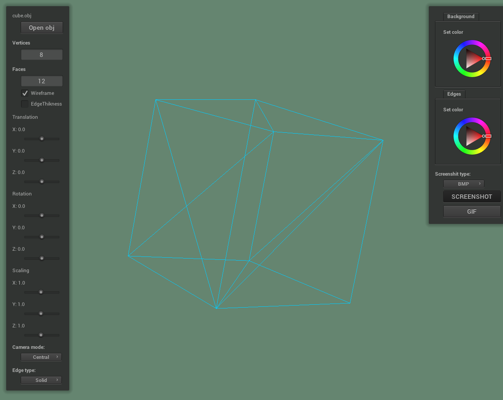

# 3D Viewer Project

This project is a 3D viewer implemented using the NanoGUI library. It follows the Model-View-Controller (MVC) pattern, where the Model is responsible for managing the mesh class, the View handles the user interface and widgets, and the Controller manages the communication between the Model and View.

## Features

- **Model:**
  - Handles loading 3D models in Wavefront OBJ format.
  - Manages mesh data, including vertices, faces.
  - Provides functions for refreshing the mesh and computing camera matrices.

- **View:**
  - Implements the user interface using NanoGUI.
  - Allows users to interact with the 3D model through sliders, buttons, and checkboxes.
  - Supports various configurations such as wireframe display, edge thickness, camera modes, and vertex display options.
  - Provides color customization options for the background, edges, and vertices.
  - Allows users to take screenshots and create GIFs of the rendered scene.

- **Controller:**
  - Bridges communication between the Model and View.
 

## MVC Pattern

The project adheres to the MVC pattern:

- **Model (`Mesh` class):**
  - Manages mesh data and computations related to the 3D model.

- **View (`Viewer3D` class):**
  - Loads shaders and initializes the viewer.
  - Constructs the graphical user interface using NanoGUI components.
  - Handles user input events and updates the interface accordingly.
  - Displays the 3D model and allows customization through sliders, checkboxes, and color wheels.
  - Computes camera matrices and handles user interactions.
 
  

- **Controller (`Controller` class):**
  - Mediates communication between the Model and View.
  - Listens to user inputs and triggers appropriate actions in the Model or View.

## Usage

1. Clone the project `git clone --recursive https://github.com/Mixaled/3D_ViewerCPP.git`.
2. Build the project by using make GNU in the src folder `make install` or create a build folder and `cmake .`
3. Open a Wavefront OBJ file using the "Open obj" button.
4. Interact with the 3D model using sliders and checkboxes in the UI.
5. Customize background and edge colors using the ColorWheel.
6. Take screenshots or create GIFs using the corresponding buttons.

## Configuration

- Configuration settings such as wireframe display, edge thickness, and camera modes can be modified through the UI.
- Configuration is saved to the "config.conf" file and it will be saved even after closing the program.

## Dependencies

- NanoGUI library is used for creating the graphical user interface. If you didn't clone with the '--recursive' flag, update dependencies using `git submodule update --init --recursive`.
- If you encounter errors, try using `make update`.

## Media

